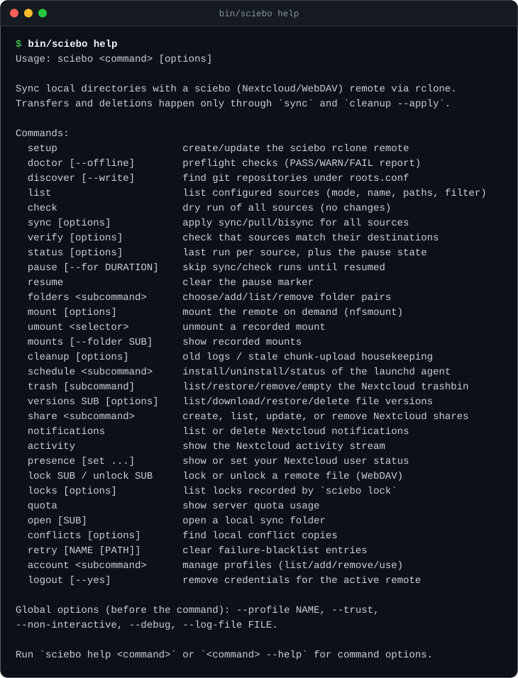
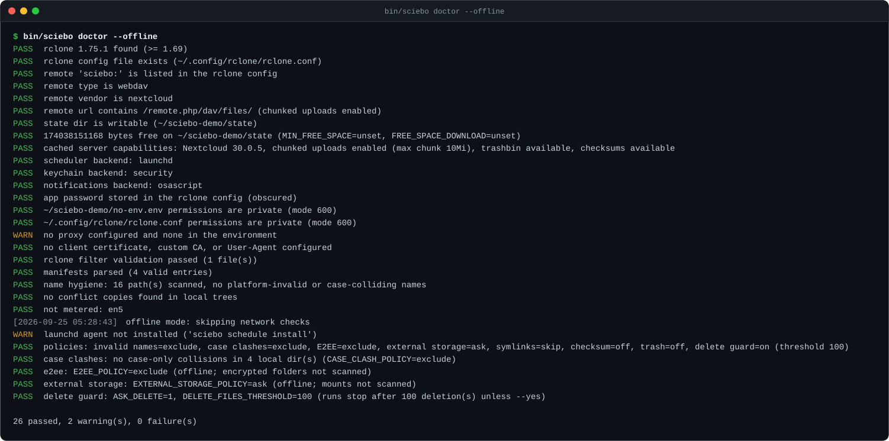
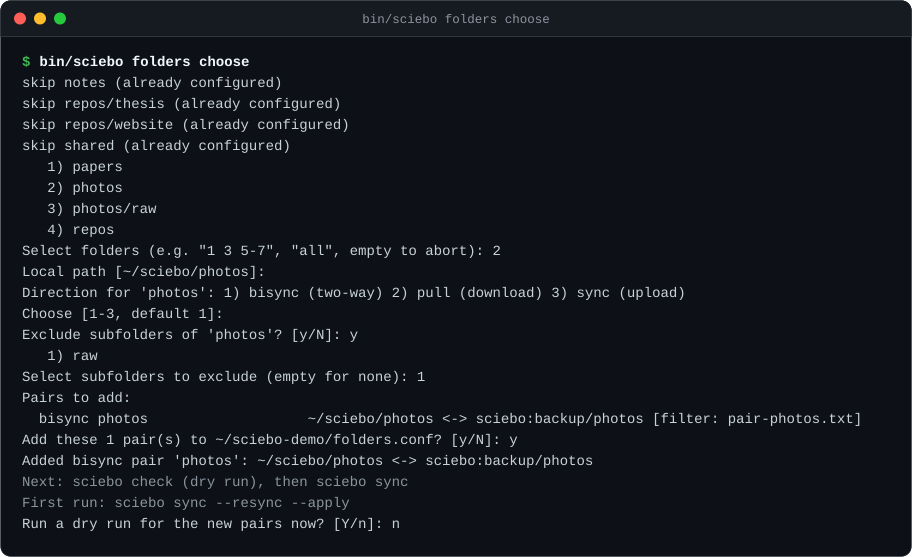
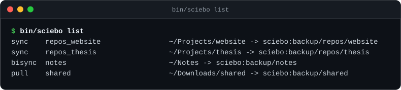
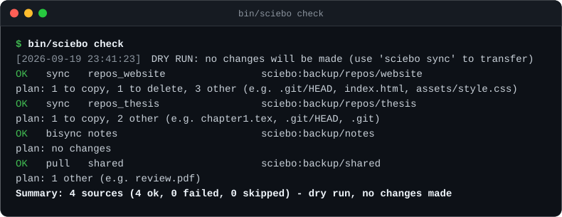
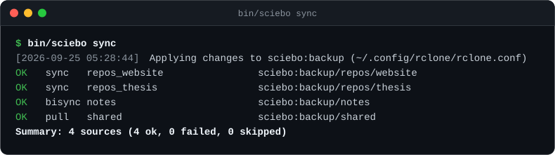
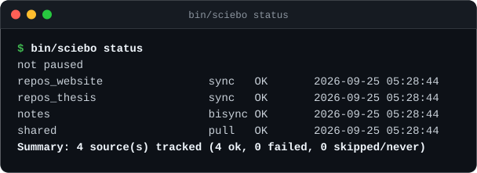

# rclone-sciebo-webdav

[](https://github.com/sebastianspicker/rclone-sciebo-webdav/actions/workflows/ci.yml)
[](LICENSE)
[](#requirements)
[](#requirements)
[](https://rclone.org)

`sciebo` is a Bash command-line tool that keeps local folders and git
repositories mirrored to a Nextcloud server over WebDAV, built on top of
[rclone](https://rclone.org/webdav/). It works with any Nextcloud instance;
[sciebo](https://www.sciebo.de), the Nextcloud service for NRW's
universities, is the default target and the tool's namesake.

What it does:

- Mirrors each folder in one direction you choose: upload (`sync`), download
  (`pull`), or two-way (`bisync`). `check` shows the plan as a dry run first.
- Adds the Nextcloud desktop client's other features as plain commands: a
  folder wizard, shares, notifications, activity, on-demand mounts, file
  locks, trash, file versions, quota, and multi-account profiles.
- Follows the desktop client's safe defaults: invalid names, case clashes,
  and E2EE folders are excluded by default, and a run that would delete a lot
  of files stops and asks first.
- Runs as a plain CLI with no daemon. `sciebo watch` and `sciebo schedule
  install` add an always-on path, but only if you opt in.

## Screenshot tour

Every image below is real CLI output, captured against a temporary local
rclone remote. Regenerate them with `make screenshots`.

**`sciebo help`** — one entrypoint, every command on one screen.



**`sciebo doctor --offline`** — preflight checks before anything touches the
network: bash and rclone versions, config sanity, the parity policies.



**`sciebo folders choose`** — a Nextcloud-client-style picker: browse the
remote, multi-select folders, and set a filter for each pair.



**`sciebo list`** — the sources you ended up with: mode, name, local and
remote paths, filter.



**`sciebo check`** — a dry run of the whole setup, with one `plan:` line per
source and nothing changed yet.



**`sciebo sync`** — the same run, applied. Transfers go to a per-source
rclone log file.



**`sciebo status`** — the last run of every source, and the pause state.



## Requirements

- macOS or Linux. The code targets Bash 5.3 or newer. macOS ships Bash 3.2 as
  `/bin/bash`, so install a newer bash (`brew install bash`) and make sure it
  is first on `PATH`; `sciebo` refuses to start on an older shell with a clear
  message.
- [rclone](https://rclone.org/downloads/) 1.69 or newer (tested with 1.75.1).
  `RCLONE_MIN_VERSION` sets the floor; `doctor` and `sync` refuse older
  binaries because bisync needs `--resilient`, `--recover`, and
  `--resync-mode`.
- curl, used for the Login Flow, the capabilities probe, and the direct
  Nextcloud HTTP/DAV/OCS calls.
- A sciebo account, or any other Nextcloud account.
- Optional helpers: `fzf` only makes the folder picker nicer; `fswatch`
  (macOS/Linux) or `inotifywait` (Linux) only makes `sciebo watch`
  event-driven, and without either `watch` falls back to portable polling.

Platform caveats:

| Feature | macOS | Linux |
| --- | --- | --- |
| Key storage (`KEYCHAIN=1`) | Keychain via `security` | `secret-tool` (libsecret) when installed, else `pass`; with neither, use `KEYCHAIN=0` (obscured password in the rclone config) |
| Desktop notifications (`NOTIFY`) | `osascript` | `notify-send`; without it, notifications are silent no-ops |
| Scheduled agent (`sciebo schedule`) | launchd | `systemd --user`; a bare `crontab` is detected but not managed |
| Change detection (`sciebo watch`) | `fswatch` when installed, else portable polling | `fswatch` or `inotifywait` when installed, else portable polling |
| Metered detection (`sciebo network`) | Wi-Fi SSID plus `METERED_SSIDS` and hotspot-name heuristics; no OS metered flag | NetworkManager (`nmcli`) reports `connection.metered` when installed |
| Open local folders (`sciebo open`) | `open` | `xdg-open` |
| On-demand mount (`sciebo mount`) | `rclone nfsmount`, no macFUSE | `rclone nfsmount`; needs the kernel NFS client and usually root |

## Install

Clone the repository and run it straight from the checkout, or install it
onto your `PATH`:

```sh
git clone https://github.com/sebastianspicker/rclone-sciebo-webdav.git
cd rclone-sciebo-webdav

bin/sciebo help          # run straight from the checkout

make install             # copies the tree to ~/.local/share/rclone-sciebo
                          # and writes a ~/.local/bin/sciebo wrapper
make install PREFIX=/usr/local
make dist                # source tarball: dist/rclone-sciebo-<version>.tar.gz
```

`make install` leaves your per-machine settings and sync state alone: it
never writes `config/settings.local.env` or `state/` into the installed
copy, whether this is a first install or a reinstall over an existing one.
`make uninstall` mirrors that and keeps `config/` and `state/` under the
installed prefix (`$PREFIX/share/rclone-sciebo`) so you can remove just the
code, or copy your settings forward before deleting the rest by hand.

### Shell completions

Completions for bash, zsh, and fish live in `completions/`, generated from
`lib/cli/sciebo.spec` (`make gen`). Enable the one you use:

| Shell | How |
| --- | --- |
| bash | Copy `completions/sciebo.bash` into a `bash-completion` completions directory, for example `~/.local/share/bash-completion/completions/sciebo`, or `source` it from `.bashrc`. |
| zsh | Copy `completions/_sciebo` onto a directory on `$fpath`, then run `compinit` (or open a new shell). |
| fish | Copy `completions/sciebo.fish` to `~/.config/fish/completions/sciebo.fish`. |

## Quick start

**1. Connect your account.** The quickest path is the Nextcloud Login Flow:

```sh
bin/sciebo setup --login    # opens the browser; password goes to the keychain
```

`--login` prompts for the server base URL (`--url URL` skips the prompt), opens
the authorization page, and polls until you grant access. The app password it
receives is stored in the platform keychain by default (macOS Keychain via
`security`, libsecret via `secret-tool`, or `pass`; service
`KEYCHAIN_SERVICE`, account `<remote>#plain`), and the rclone config then holds
only an obscured empty value. Storing the plaintext means HTTP-backed commands
never run `rclone reveal`; a legacy obscured keychain item is migrated once on
first use, and `logout` removes both items. With `KEYCHAIN=0`, `--no-keychain`
for one run, or no backend installed, the obscured password lives in the
rclone config instead.

Or create an app password by hand in sciebo under *Settings → Security →
Devices & sessions* (required with two-factor authentication and recommended
for third-party clients; see the
[sciebo docs](https://docs.sciebo.de/docs/sicherheit/); never use your main
password) and provide it in `.env`:

```sh
cp .env.example .env    # fill in SCIEBO_URL, SCIEBO_USER, SCIEBO_APP_PASSWORD
bin/sciebo setup        # writes the remote into ~/.config/rclone/rclone.conf
```

`SCIEBO_USER` looks like `alice@your-university.de`, or a plain username on a
Nextcloud server that doesn't use the `user@domain` scheme. Find your
institution's server in the
[sciebo server list](https://docs.sciebo.de/docs/getting-started/webinterface/serverliste/).
`setup` normalizes the URL to `https://<host>/remote.php/dav/files/<user>/` so
Nextcloud chunked uploads work, validates the remote, probes and prints the
server capabilities, and never writes credentials into this repository.
`sciebo setup --rotate` fetches a fresh app password for an already-configured
remote without changing its URL or user.

Coming from the Nextcloud desktop client? `bin/sciebo account import
--dry-run` previews how `nextcloud.cfg` maps (accounts to profiles, folders to
`bisync` pairs, the known General options to settings), and `bin/sciebo
account import` applies it. Passwords are never imported, so finish every
imported profile with `bin/sciebo setup --login` (add `--profile NAME` for a
named profile, or run `setup --rotate` when the remote already exists).

**2. Multiple accounts?** Profiles keep their own manifests, filters, state,
and keychain service:

```sh
bin/sciebo account add work --remote sciebo-work --base backup
bin/sciebo --profile work setup --login
bin/sciebo --profile work folders choose
```

**3. Add what to sync.** Either edit `config/sources.conf`:

```
sync|~/Projects/my-app|repos/my-app
bisync|~/Notes|notes
```

or let the wizard pick remote folders for you:

```sh
bin/sciebo folders choose
```

You can also import a `nextcloudcmd --unsyncedfolders` list with
`bin/sciebo folders import`.

**4. Look before you leap.**

```sh
bin/sciebo doctor       # preflight checks (add --offline to skip the network)
bin/sciebo list         # parsed sources at a glance
bin/sciebo check        # dry run of everything, with a plan: line per source
bin/sciebo sync         # apply
bin/sciebo status       # last run per source (+ --history)
```

Initialize each `bisync` source once with `bin/sciebo sync --resync --apply`,
and review the resync warning under
[Direction semantics](docs/commands.md#direction-semantics) first.

**5. Inspect and tune.**

```sh
bin/sciebo config check      # settings, manifest, filters, state dirs
bin/sciebo config list       # effective settings and their source layer
bin/sciebo network           # interface, metered state, proxy mode
bin/sciebo limit --up 2M --until 2h   # cap later runs; `unlimited` lifts it
```

`config get KEY` prints one effective value, and `config edit` opens
`config/settings.local.env`. For a time-of-day cap instead of a one-shot
marker, set `BW_SCHEDULE` (rclone's timetable syntax).

**6. Keep it running (opt-in).**

```sh
bin/sciebo watch              # foreground: sync sources when they change
bin/sciebo schedule install --at-login --profiles work,home
```

`watch` is a foreground command, not a daemon: it uses `fswatch` or
`inotifywait` when installed and falls back to portable polling, with
`--remote-interval` optionally polling the server (dry run, notify only).
`schedule install --at-login` installs a launchd or systemd `--user` agent
that runs `sync --apply --quiet` periodically, one agent per profile with
`--profiles`. Nothing runs in the background unless you start or install it.

## Commands

Run `bin/sciebo` from the project root, or put it on your `PATH` after
`make install`. The commands below are grouped by what they're for; the full
option tables, exit codes, and examples are in
[docs/commands.md](docs/commands.md). Several also have a `make` target
(`make help` lists them), but the CLI is the complete interface.

| Group | Commands |
| --- | --- |
| Account and setup | `setup`, `provision`, `account`, `logout`, `config` |
| Preflight and discovery | `doctor`, `discover`, `list`, `filters`, `ignored`, `network`, `folders` |
| Syncing | `check`, `sync`, `nextcloudcmd`, `watch`, `edit`, `verify`, `status`, `pause`, `resume`, `limit`, `unlimited` |
| Mounts | `mount`, `umount`, `mounts`, `hydrate`, `open` |
| Housekeeping and scheduling | `cleanup`, `logs`, `schedule`, `support`, `retry`, `conflicts` |
| Server features (shares, activity, etc.) | `share`, `notifications`, `activity`, `presence`, `lock`, `unlock`, `locks`, `quota`, `file`, `search`, `recent`, `comments`, `favorites`, `tags`, `server`, `trash`, `versions`, `announcements`, `preview`, `download` |
| Other | `update`, `help` |

Global options may appear before or after the command, but they are consumed
before the command runs: `--profile NAME`, `--trust`, `--non-interactive`,
`--debug`, `--log-file FILE`, `--log-dir DIR`, `--log-expire HOURS`,
`--confdir DIR`, `--version`.

## Configuration

Settings live in `config/settings.env` (tracked defaults) and
`config/settings.local.env` (your gitignored overrides); a profile can add
its own layer on top. `sciebo config list` prints every effective setting and
which layer it came from, and `sciebo config edit` opens the local override
file. Every setting, its default, and the precedence rules are in
[docs/settings.md](docs/settings.md).

## Safety model

- `check` and `verify` never change anything; transfers and deletions happen
  only through `sync` and `cleanup --apply`, one run at a time behind a lock.
- Desktop-client parity policies are safe by default: invalid names, local
  case-only collisions, and server-side E2EE folders are excluded from a
  transfer; external storages and big folders ask before the first sync.
- A `sync` that would delete more files than `DELETE_FILES_THRESHOLD` stops
  and asks (or fails a non-interactive run) unless `sync --yes` is given.
- Git is not special-cased: `.git/` syncs as files, so avoid syncing a repo
  while git is rewriting objects, and don't run `bisync` on a repository
  you're actively working in.
- Bisync conflict copies stay local by default; `conflicts --resolve`
  reviews and resolves them.

The full policy list, conflict handling, and what's deliberately out of
scope (Nextcloud E2EE, a background sync daemon, a virtual-files overlay) are
in [docs/parity.md](docs/parity.md).

## sciebo etiquette

This section is about the sciebo service specifically; other Nextcloud
servers may set different limits. sciebo warns that WebDAV is unsupported
and asks users to keep sync intervals large and sync only what is needed.
The defaults here are deliberately gentle (`TRANSFERS=2`, `CHECKERS=4`,
`TPSLIMIT=8`); override them in `config/settings.local.env` for a
self-hosted or more permissive server. Nextcloud admins can raise the chunk
size to 1 GB server-side for better throughput ([Nextcloud
docs](https://docs.nextcloud.com/server/latest/admin_manual/configuration_files/big_file_upload_configuration.html#adjust-chunk-size-on-nextcloud-side)).
`MAX_PARALLEL_SOURCES` is `1` for the same reason; raise it only if the server
can take the extra connections. Upload chunking follows the desktop client:
with `CHUNK_SIZE` unset, a chunk is derived once per run from
`TARGET_CHUNK_UPLOAD_DURATION` times the effective upload throughput
(`BW_LIMIT_UP`, else `TARGET_UPLOAD_THROUGHPUT`), capped at the server's
maximum and clamped to `MIN_CHUNK_SIZE`/`MAX_CHUNK_SIZE` (`CHUNK_SIZE` always
wins).

## Documentation

| Page | Contents |
| --- | --- |
| [docs/commands.md](docs/commands.md) | every command, subcommand, option, exit code, and example |
| [docs/settings.md](docs/settings.md) | every setting, precedence, profiles, state layout |
| [docs/architecture.md](docs/architecture.md) | module map, command conventions, lock/state/HTTP design |
| [docs/parity.md](docs/parity.md) | Nextcloud Desktop parity matrix and its limits |
| [SECURITY.md](SECURITY.md) | where the app password lives and what protects it |
| [CONTRIBUTING.md](CONTRIBUTING.md) | development setup, tests, style |
| [CHANGELOG.md](CHANGELOG.md) | what changed in each release |

[docs/index.html](docs/index.html), also published at
<https://sebastianspicker.github.io/rclone-sciebo-webdav/>, is a standalone
demo page with the full screenshot gallery and quick-start snippets.

## Development

```sh
make lint         # shellcheck + shfmt, plus a syntax check of tools/screenshots.py
make test         # tests/unit.sh + tests/features.sh + tests/integration.sh
make screenshots  # regenerate docs/assets/screenshots/*.svg
```

The tests never touch sciebo or your real configuration: state, manifests, and
the remote are redirected into a temp directory, and the integration suite runs
against a temporary `local` rclone remote. See
[docs/architecture.md](docs/architecture.md#tests-and-tooling) for the suite layout and
[CONTRIBUTING.md](CONTRIBUTING.md) before opening a pull request.

## Migrating from `scripts/*.sh`

If a launchd agent was installed for the old `scripts/sync.sh` entrypoint,
re-run `bin/sciebo schedule install` once; it rewrites the plist to run
`bash <project>/bin/sciebo sync --apply --quiet`. `sciebo doctor` and
`sciebo schedule status` warn while an installed plist still points at the old
entrypoint. A compatibility shim remains at `scripts/sync.sh` (`--apply` means
`sync`, `--list` means `list`), and `scripts/nextcloudcmd` forwards to
`bin/sciebo nextcloudcmd` for cron jobs and scripts that still call the old
nextcloudcmd wrapper; delete both once every machine has been updated.

## Contributing and security

Bug reports and pull requests are welcome; see
[CONTRIBUTING.md](CONTRIBUTING.md) for the development setup and test
commands. Report suspected vulnerabilities privately as described in
[SECURITY.md](SECURITY.md), not in a public issue.

## License

[MIT](LICENSE)
